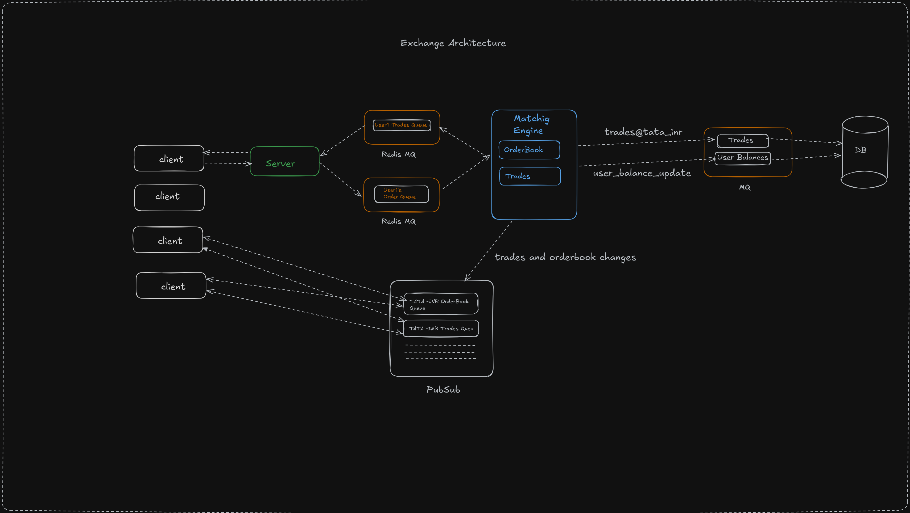

# Exchange - Web-based application provide marketplace allow to buy and sell of securities.

### Core Functionalities

1. Order Placement

   - It demand less than millisecond latency

2. Realtime feedback of changes in

   - Orderbook
   - Trades

3. Trading charts

### Tech-Stack

1. Frontend - NextJS, NextAuth
2. Server - NodeJS
3. Message Queue - RedisMQ and RedisPubSub as it store/create queues in-memory.
4. Database - TimesericeDB - to store time-stamped data for futher computation like computing chart over a period of time.
5. Realtime Communication - WebSockets
6. Containerisation - Docker
7. Container Orchestration - Docker Compose

### Architecture



### How to use

```sh
docker compose up
```

Client started on: http://localhost:3000
